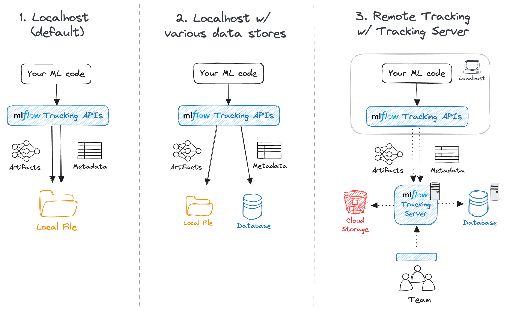
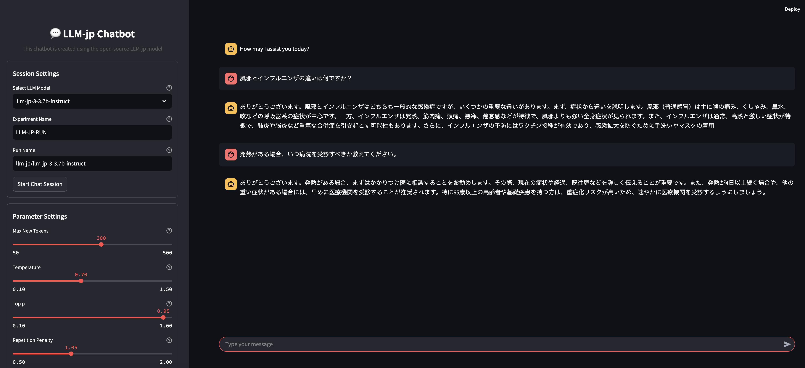
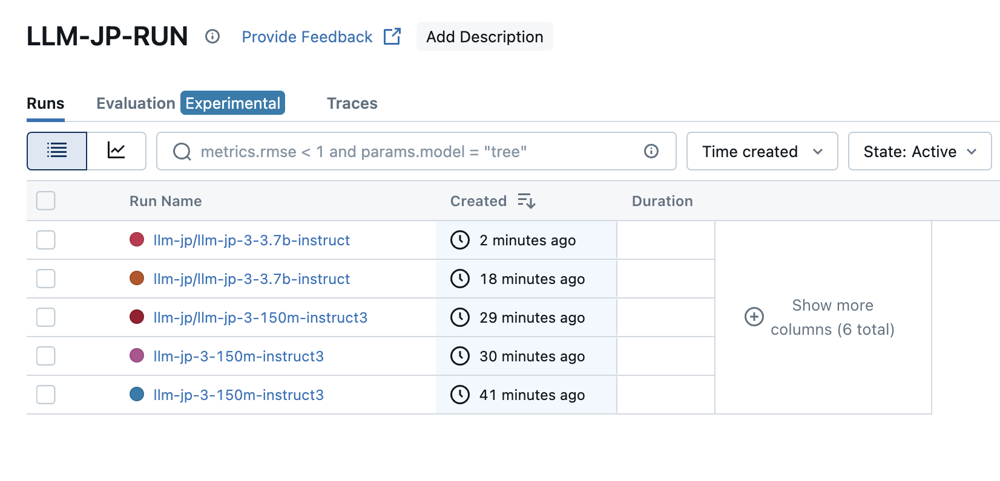
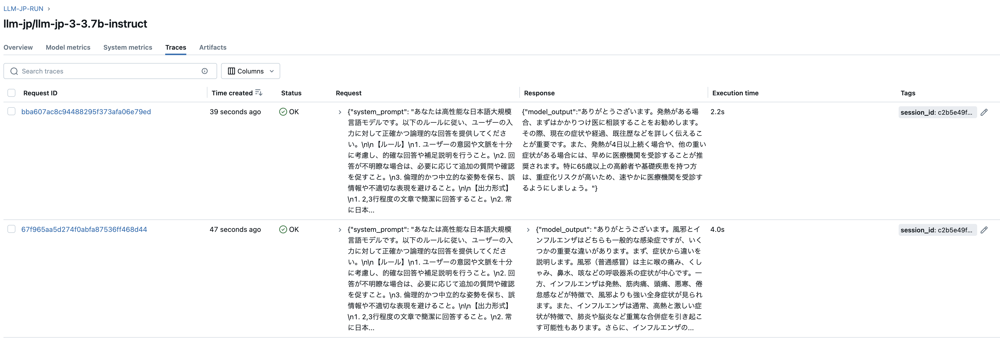
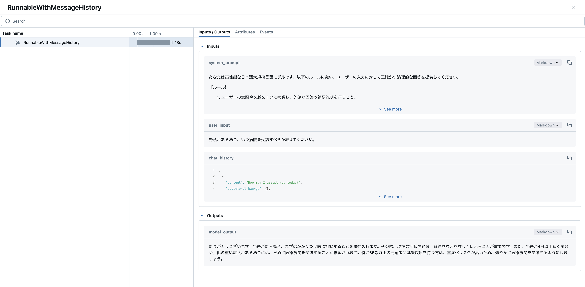
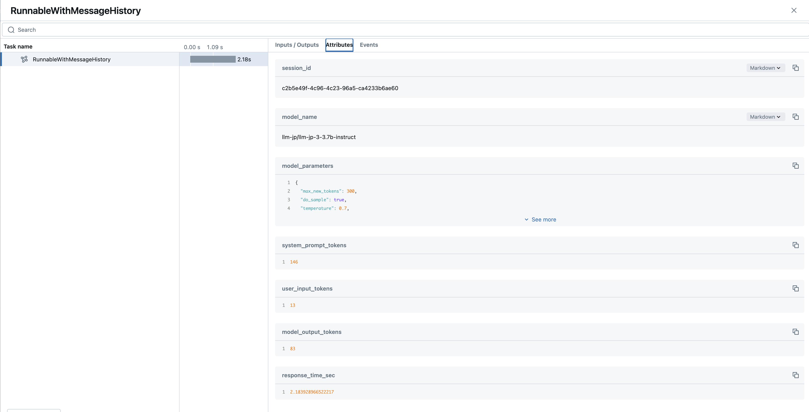
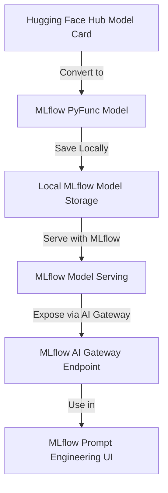
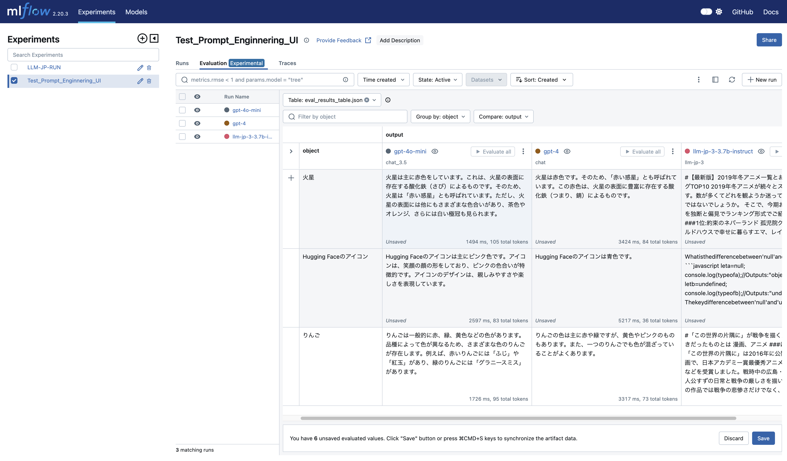

## LLM-JP provenance management with MLflow LLMs
  

👉 [Japanese Article of this repository](https://zenn.dev/shosuke_13/articles/21d304b5f80e00)


This repository provides a practical guide and working example for integrating MLflow Prompt Engineering UI with non-officially supported Japanese LLMs, specifically from the LLM-jp project.

MLflow Prompt Engineering UI is an experimental feature allowing users to test and optimize prompts in a no-code UI. It supports OpenAI and other hosted models, but local models like those from LLM-jp require manual setup.

This repository shows how to:
- Use MLflow Model Serving to serve local LLM-jp models via pyfunc.PythonModel
- Expose the local models through MLflow AI Gateway
- Run prompt optimization experiments via Prompt Engineering UI

## Usage 

1. serve local models via pyfunc.PythonModel
```bash
python wrap_pyfunc.py
```

2. MLflow Tracing and Streamlit UI
```bash
mlflow ui --backend-store-uri sqlite:///mlruns/mlflow.db --port 5000

streamlit run app.py --server.fileWatcherType none
```

3. AI gateway and prompt enginnering
```bash
export MLFLOW_DEPLOYMENTS_TARGET="http://127.0.0.1:7000"
export OPENAI_API_KEY="" # if you use OpenAI Model for LLM-as-a-judge

mlflow models serve -m ./saved_model/ --no-conda --port 5001

mlflow gateway start --config-path config.yaml --port 7000
mlflow server --port 5000
```


## Tracking Backend

- [Tracking Experiments with a Local Database](https://mlflow.org/docs/latest/tracking/tutorials/local-database.html)



> The MLflow client can interface with a SQLAlchemy-compatible database (e.g., SQLite, PostgreSQL, MySQL) for the backend. Saving metadata to a database allows you cleaner management of your experiment data while skipping the effort of setting up a server.

## Screenshots
### Streamlit UI


### MLflow Tracing and UI






### Mlflow AI Gateway and Prompt Enginnering UI





## ⚠️ Known Issues
Japanese prompt input may cause encoding issues in Prompt Engineering UI. 
Workaround: use ASCII-only prompts or sanitize input manually.

## References
- [LLM-jp:
A Cross-organizational Project for the Research and
Development of Fully Open Japanese LLMs](https://arxiv.org/pdf/2407.03963)
- [LLM-jp: 日本語に強い大規模言語モデルの研究開発を行う
組織横断プロジェクト](https://www.jstage.jst.go.jp/article/jnlp/31/1/31_266/_pdf/-char/ja)
- [MLflow Tracing for LLM Observability
](https://mlflow.org/docs/latest/llms/tracing/index.html#automatic-tracing)
- [LLM 勉強会](https://llm-jp.nii.ac.jp/)
- [Hugging Face LLM-jp](https://huggingface.co/llm-jp)
- [Prompt Engineering UI (Experimental)
](https://mlflow.org/docs/latest/llms/prompt-engineering/index.html)
- [MLflow AI Gateway (Experimental)
](https://mlflow.org/docs/latest/llms/deployments/index.html?utm_source=chatgpt.com)

## LLM-jp Model List
-  [LLM-jp-3 Fine-tuned Models](https://huggingface.co/collections/llm-jp/llm-jp-3-fine-tuned-models-672c621db852a01eae939731)
    - [llm-jp/llm-jp-3-150m-instruct2](https://huggingface.co/llm-jp/llm-jp-3-150m-instruct2)
    - [llm-jp/llm-jp-3-150m-instruct3](https://huggingface.co/llm-jp/llm-jp-3-150m-instruct3)
    - [llm-jp/llm-jp-3-440m-instruct2](https://huggingface.co/llm-jp/llm-jp-3-440m-instruct2)
    - [llm-jp/llm-jp-3-440m-instruct3](https://huggingface.co/llm-jp/llm-jp-3-440m-instruct3)
    - [llm-jp/llm-jp-3-980m-instruct2](https://huggingface.co/llm-jp/llm-jp-3-980m-instruct2)
    - [llm-jp/llm-jp-3-980m-instruct3](https://huggingface.co/llm-jp/llm-jp-3-980m-instruct3)
    - [llm-jp/llm-jp-3-1.8b](https://huggingface.co/llm-jp/llm-jp-3-1.8b)
    - [llm-jp/llm-jp-3-1.8b-instruct](https://huggingface.co/llm-jp/llm-jp-3-1.8b-instruct)
    - [llm-jp/llm-jp-3-1.8b-instruct2](https://huggingface.co/llm-jp/llm-jp-3-1.8b-instruct2)
    - [llm-jp/llm-jp-3-1.8b-instruct3](https://huggingface.co/llm-jp/llm-jp-3-1.8b-instruct3)
    - [llm-jp/llm-jp-3-3.7b](https://huggingface.co/llm-jp/llm-jp-3-3.7b)
    - [llm-jp/llm-jp-3-3.7b-instruct](https://huggingface.co/llm-jp/llm-jp-3-3.7b-instruct)
    - [llm-jp/llm-jp-3-3.7b-instruct2](https://huggingface.co/llm-jp/llm-jp-3-3.7b-instruct2)
    - [llm-jp/llm-jp-3-3.7b-instruct3](https://huggingface.co/llm-jp/llm-jp-3-3.7b-instruct3)
    - [llm-jp/llm-jp-3-7.2b-instruct](https://huggingface.co/llm-jp/llm-jp-3-7.2b-instruct)
    - [llm-jp/llm-jp-3-7.2b-instruct2](https://huggingface.co/llm-jp/llm-jp-3-7.2b-instruct2)
    - [llm-jp/llm-jp-3-7.2b-instruct3](https://huggingface.co/llm-jp/llm-jp-3-7.2b-instruct3)
    - [llm-jp/llm-jp-3-13b](https://huggingface.co/llm-jp/llm-jp-3-13b)
    - [llm-jp/llm-jp-3-13b-instruct](https://huggingface.co/llm-jp/llm-jp-3-13b-instruct)
    - [llm-jp/llm-jp-3-13b-instruct2](https://huggingface.co/llm-jp/llm-jp-3-13b-instruct2)
    - [llm-jp/llm-jp-3-13b-instruct3](https://huggingface.co/llm-jp/llm-jp-3-13b-instruct3)
    - [llm-jp-3-172b-beta1](https://huggingface.co/llm-jp/llm-jp-3-172b-beta1)
    - [llm-jp/llm-jp-3-172b-beta1-instruct](https://huggingface.co/llm-jp/llm-jp-3-172b-beta1-instruct)
    - [llm-jp/llm-jp-3-172b-instruct2](https://huggingface.co/llm-jp/llm-jp-3-172b-instruct2)
    - [llm-jp/llm-jp-3-172b-instruct3](https://huggingface.co/llm-jp/llm-jp-3-172b-instruct3)
